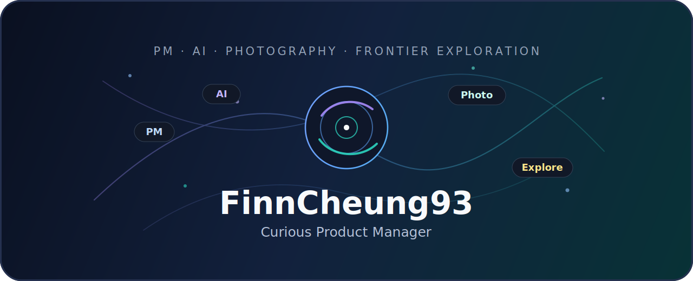

<div align="center">



<br>

[](https://git.io/typing-svg)

<br>

<p>
  
  
  
  
</p>

</div>

```text
这里主要放我为 Codex / AI Coding 工作流整理的 Skills。
核心方向是：让 PM 的需求、规格、原型和协作上下文，更容易被 AI Agent 读取、执行和复用。
```

## 🧭 PM 工作流系列

这一组 Skills 用来把产品想法逐步推进到 AI Coding 可执行状态。推荐顺序是：地基 → PRD → Spec → 原型。

| 顺序 | Skill | 作用 |
|---|---|---|
| 1 | [AI Coding 地基](https://github.com/FinnCheung93/aicoding-foundation) | 项目开工前，初始化原则、状态、日志和协作治理 |
| 2 | [PM PRD 助手](https://github.com/FinnCheung93/pm-prd-copilot) | 澄清、撰写、修订和审查开发可落地的 PRD |
| 3 | [AI Coding 规范文档](https://github.com/FinnCheung93/aicoding-specpilot) | 基于 PRD 生成更适合 AI Coding 读取的规格文档 |
| 4 | [PM 原型助手](https://github.com/FinnCheung93/finn-protopilot) | 基于 PRD / Spec 生成产品走查原型和演示材料 |

<sub>这些 Skills 可以按完整链路使用，也可以在具体任务里单独调用。</sub>

## 🧰 其他 Skills

- [拷打万物](https://github.com/FinnCheung93/grill-everything)：对方案、PRD、技术设计、商业模式和关键决策做严肃压力测试。
- [Skill 吸星大法](https://github.com/FinnCheung93/skill-siphon)：分析、审查、对比和优化 Codex Skills 的方法型 Skill。
- [Codex 会话搬家](https://github.com/FinnCheung93/codex-session-mover)：迁移 Codex Desktop / CLI 会话记录到新的项目目录。

## ✨ 我在整理什么

- 面向 PM 的 AI Coding 工作流
- 开发可落地的 PRD 与规格表达
- 能被 AI Agent 稳定读取的项目上下文
- 从想法、文档到原型的轻量协作链路
- 可复用、可审查、边界清楚的 Codex Skills

## 📌 使用方式

每个 Skill 都是独立仓库。进入对应仓库后，将其中的 skill 目录安装或复制到你的 Codex skills 目录即可。

```text
SKILL.md
```

## 📊 GitHub 状态

<p>
  
  
</p>

<sub>这些仓库暂未提供开源许可证，默认保留所有权利。</sub>
